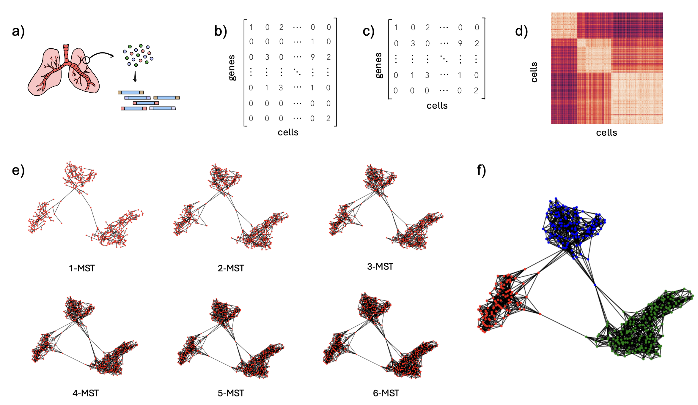
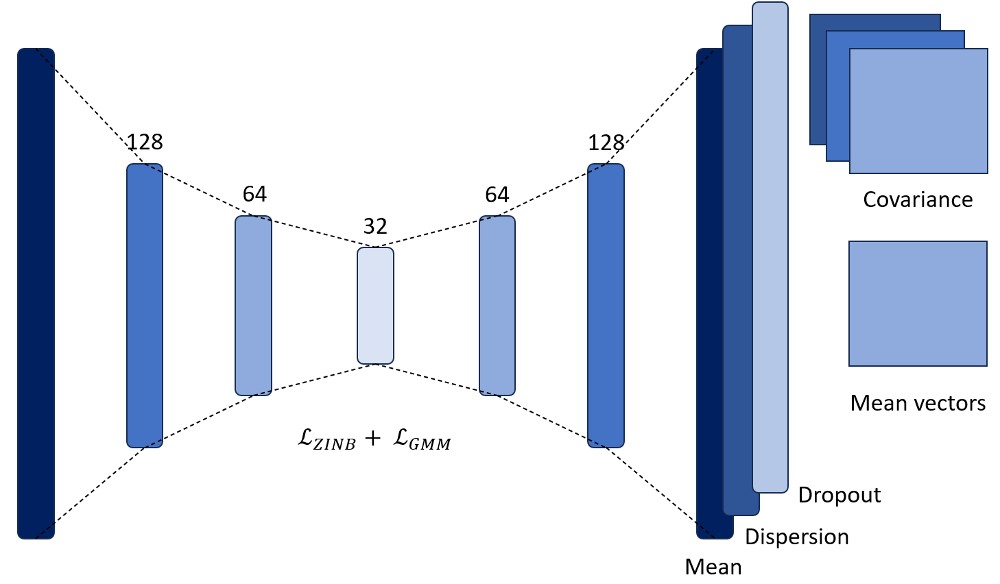

# scRANGE
The identification of cell types is a basic step of the pipeline for Single-Cell RNA sequencing data analysis. However, unsupervised clustering of cells from scRNA-seq data has multiple challenges: the high dimensional nature of the data, the sparse nature of the gene expression matrix, and the presence of technical noise that can introduce false zero entries. In this repository, we present new algorithms for clustering scRNA-seq data. The first algorithm builds a k-MST graph from distances obtained directly from the input data without dimensionality reduction. The computation follows an iterative procedure of k steps in which each step calculates and stores the edges of minimum spanning trees over different subgraphs obtained removing edges selected in previous iterations. The Louvain algorithm is executed on the k-MST graph for cell clustering. We also explored alternatives based on neural networks in which an autoencoder is used to learn the parameters of a Gaussian mixture model, aiming to improve the handling of clusters with different shapes and sizes.

## Algorithms
### k-MST

Graph-based scRNA-seq clustering pipeline. a) Perform single-cell RNA sequencing. b) Generate the count matrix. c) Gene filtering: Retain only the 5000 genes with the highest upward deviation from the adjusted variance. d) Compute the pairwise Pearson correlation between cells. e) Compute the k-MST graph f) Apply the Louvain algorithm for community detection.

### AE-GMM

Following the methodology of scDCC [1], the training of the network is performed in two stages. First, the autoencoder is pretrained with the $\mathcal{L}_{ZINB}$ loss function. Then, a fine-tuning stage is performed in which the latent representation is optimized, guided by the GMM loss function. The model learns the parameters of each Gaussian function at this stage to perform probabilistic clustering. Specifically, it learns three parameters: $\pi_c \in \mathbb{R}$, $\mu_c \in \mathbb{R}^{32}$, and $\Sigma_c \in \mathbb{R}^{32×32}$ for each cluster $c$. The value of $\mu_c$ represents the mean of the cluster $c$. These mean values are initialized as the centroids found by the k-Means algorithm. For each cluster $c$, $\Sigma_c$ represents the covariance matrix of c and πc represents its weight, which can be understood as the prior probability that a cell is assigned to such cluster. 

## Usage
### k-MST
To run the kMST algorithm, ensure that all required dependencies are installed. A `environment.yml` file containing the necessary libraries is available in the `kMST/` folder. Navigate to the folder and create the Conda environment by running:
```
conda env create -f environment.yml
```

Once the installation is complete, activate the environment
```
conda activate env_sc
```

With the environment activated, you can execute the algorithm using the following code:

```
python kMST.py <path_input> <path_output> <filter>
```

- `path_input`: Must be a folder with the scRNA-seq experiment containing a `matrix.mtx` file, a `barcodes.tsv` with the cell information and a `genes.tsv` with the gene information. 
- `path_output`: Must be a folder. The results will be saved here.
- `filter`: Must be one of the following
    1. `"mean-variance"`: Select the 5000 genes with the largest difference between the actual variance and the expected variance.
    2. `"variance"`: Select the 5000 genes with higher variance.
    3. `""`: No gene selection. 

Example:
```
python kMST.py "../Data/Simulated/symsim_500_1500_3_0.01_1000/" "../results/symsim_kmst/" "mean-variance"
```

### AE-GMM
**Note:** A GPU is needed in order to excecute the AE-GMM neural network.

To run the AE-GMM algorithm, ensure that all required dependencies are installed. A `environment.yml` file containing the necessary libraries is available in the `AE-GMM/` folder. Navigate to the folder and create the Conda environment by running:
```
conda env create -f environment.yml
```


Once the installation is complete, activate the environment
```
conda activate env_aegmm
```

With the environment activated, you can execute the algorithm using the following code:

```
python NN_run_GMM.py <path_input> <path_output> <n_clusters>
```
- `path_input`: Must be a folder with the scRNA-seq experiment containing a `matrix.mtx` file, a `barcodes.tsv` with the cell information and a `genes.tsv` with the gene information. 
- `path_output`: Must be a folder. The results will be saved here.
- `n_clusters`: Integer with the number of clusters to be created. 

Example:
```
python NN_run_GMM.py "../Data/Simulated/symsim_500_1500_3_0.01_1000/" "../results/symsim_aegmm/" 3
```

## Data Availability
The epilepsy dataset and the simulations made with the Symsim tool [2] can be found in the `Data` folder.

## References
[1] Tian, T., Zhang, J., Lin, X., Wei, Z., Hakonarson, H.: Model-based deep embedding for constrained clustering analysis of single cell rna-seq data (2021) https: //doi.org/10.1038/s41467-021-22008-3 

[2] Qin, F., Luo, X., Xiao, F., Cai, G.: Scrip: An accurate simulator for single-cell rna sequencing data. Bioinformatics 38, 1304–1311 (2022) https://doi.org/10.1093/bioinformatics/btab824

## Contact
Melissa Robles mv.robles@uniandes.edu.co