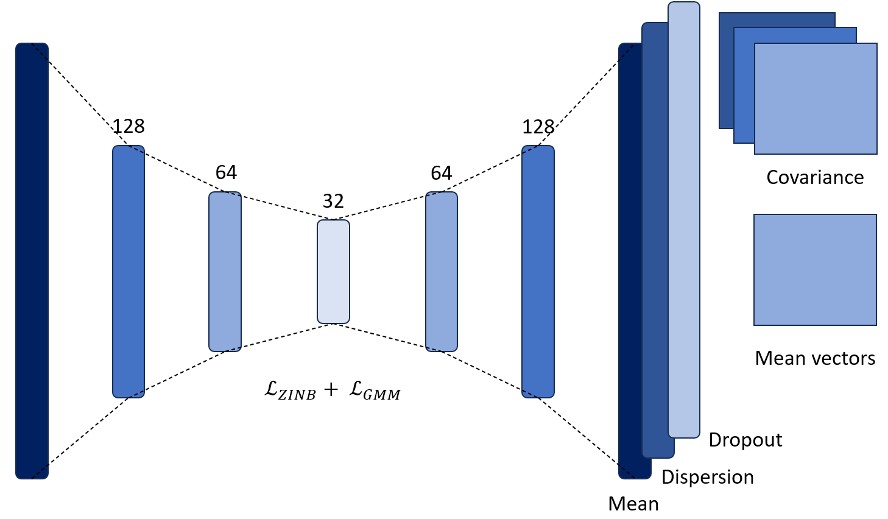

# scRANGE
The identification of cell types is a basic step of the pipeline for Single-Cell RNA sequencing data analysis. However, unsupervised clustering of cells from scRNA-seq data has multiple challenges: the high dimensional nature of the data, the sparse nature of the gene expression matrix, and the presence of technical noise that can introduce false zero entries. In this repository, we present new algorithms for clustering scRNA-seq data. The first algorithm builds a k-MST graph from distances obtained directly from the input data without dimensionality reduction. The computation follows an iterative procedure of k steps in which each step calculates and stores the edges of minimum spanning trees over different subgraphs obtained removing edges selected in previous iterations. The Louvain algorithm is executed on the k-MST graph for cell clustering. We also explored alternatives based on neural networks in which an autoencoder is used to learn the parameters of a Gaussian mixture model, aiming to improve the handling of clusters with different shapes and sizes. Finally, a third algorithm is introduced, which uses the Human Protein Atlas database of single-cell expression profiles. The algorithm computes the correlation between each experimental cell and the reference expression patterns in the database. Based on these correlations, it assigns the most likely cell type to each cell in the experiment.

## Usage 
### Prerequisites
- Python 3.10.9
- [uv](https://github.com/astral-sh/uv) package manager

### Instalation
```
# Clone the repository
git clone https://github.com/mvrobles/scRANGE.git
cd scRANGE

# Install dependencies
uv sync
```

## Project Structure

```
scRANGE/
├── data/              # Dataset storage and data files
├── docs/              # Documentation files
├── results/           # Experimental results and outputs
├── src/               # Source code 
├── .gitignore         # Git ignore patterns
├── .python-version    # Python version specification
├── pyproject.toml     # Project metadata and dependencies
├── uv.lock            # Locked dependency versions
└── README.md          # This file
```

## Input data format
`path_input` must be a directory containing a scRNA-seq experiment with the following files:
```
path_input/
├── matrix.mtx          # gene-cell count matrix
├── barcodes.tsv        # cell identifiers
└── genes.tsv           # gene identifiers
```

## Run the algorithms
All algorithms are executed from the `src` directory using uv:
```
uv python scRANGE.py <method> <path_input> <path_output> [options]
```
- `method`: Indicates the algorithm to be excecuted. Could be `kmst`, `ae-gmm` or `scdcc`
- `path_input`: Must be a folder with the scRNA-seq experiment containing a `matrix.mtx` file, a `barcodes.tsv` with the cell information and a `genes.tsv` with the gene information. 
- `path_output`: Must be a folder. The results will be saved here.

## Methods
### 1. kMST
For the kMST algorithm, the type of gene filter is required.
```
uv python scRANGE.py kmst <path_input> <path_output> --filter <filter>
```
Available filters:
1. `"mean-variance"`: Select the 5000 genes with the largest difference between the actual variance and the expected variance.
2. `"variance"`: Select the 5000 genes with higher variance.
3. `""`: No gene selection. 

### 2. AE-GMM
For the scRANGE algorithm, the number of clusters is required.
```
uv python scRANGE.py ae-gmm <path_input> <path_output> --n_clusters <int>
```

### 3. Correlations
For the scRANGE algorithm, the only parameter needed is the input and output paths.
```
uv python scRANGE.py correlations <path_input> <path_output> 
```

### 4. scDCC
scRANGE adapts [scDCC](https://github.com/ttgump/scDCC). The number of clusters is required. The algorithm supports other arguments from the original repository.
```
uv python scRANGE.py scdcc <path_input> <path_output> --n_clusters <int> [options]
```

## Data Availability
The epilepsy dataset and the simulations made with the Symsim tool [2] can be found in the `Data` folder.

## Algorithms
### k-MST

Graph-based scRNA-seq clustering pipeline. a) Perform single-cell RNA sequencing. b) Generate the count matrix. c) Gene filtering: Retain only the 5000 genes with the highest upward deviation from the adjusted variance. d) Compute the pairwise Pearson correlation between cells. e) Compute the k-MST graph f) Apply the Louvain algorithm for community detection.

### AE-GMM

Following the methodology of scDCC [1], the training of the network is performed in two stages. First, the autoencoder is pretrained with the $\mathcal{L}_{ZINB}$ loss function. Then, a fine-tuning stage is performed in which the latent representation is optimized, guided by the GMM loss function. The model learns the parameters of each Gaussian function at this stage to perform probabilistic clustering. Specifically, it learns three parameters: $\pi_c \in \mathbb{R}$, $\mu_c \in \mathbb{R}^{32}$, and $\Sigma_c \in \mathbb{R}^{32×32}$ for each cluster $c$. The value of $\mu_c$ represents the mean of the cluster $c$. These mean values are initialized as the centroids found by the k-Means algorithm. For each cluster $c$, $\Sigma_c$ represents the covariance matrix of c and πc represents its weight, which can be understood as the prior probability that a cell is assigned to such cluster. 

### Correlations

Cell type annotation using expression correlations. a) Obtain reference expression profiles for multiple cell types across tissues from the Human Protein Atlas. b) Obtain the gene-by-cell count matrix from the single-cell RNA-seq experiment. c) Compute a correlation matrix between each experimental cell and each reference cell type profile. d) Assign each cell in the experiment to the cell type with the highest correlation score.

## References
[1] Tian, T., Zhang, J., Lin, X., Wei, Z., Hakonarson, H.: Model-based deep embedding for constrained clustering analysis of single cell rna-seq data (2021) https: //doi.org/10.1038/s41467-021-22008-3 

[2] Zhang, X., Xu, C. & Yosef, N. Simulating multiple faceted variability in single cell RNA sequencing. Nat Commun 10, 2611 (2019). https://doi.org/10.1038/s41467-019-10500-w

## Contact
Melissa Robles mv.robles@uniandes.edu.co